## KURS DOCKERA

### Część 1
#### Uruchomienie nowego kontenera na podstawie obrazu ubuntu
`docker run ubuntu ls -l`
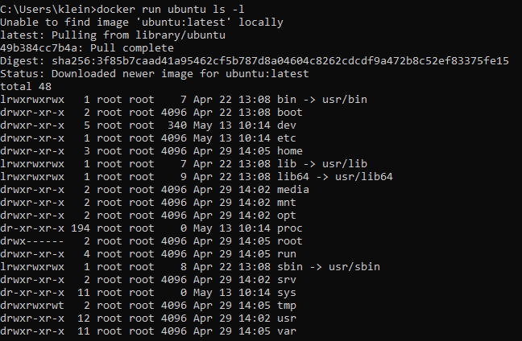

#### Wyświetlenie wersji jądra systemu operacyjnego
`docker run ubuntu uname -a`
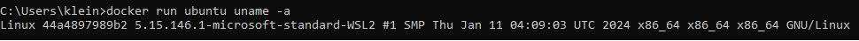

#### Zmiana obrazu na inną dystrybucję Linuxa 
`docker run debian uname -a`
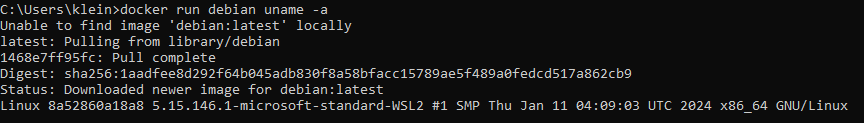

#### Uruchomienie kontenera bash 
`docker run --interactive --tty ubuntu bash`
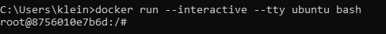

Możemy robić różne operacje wewnątrz pliku
`ls -l`
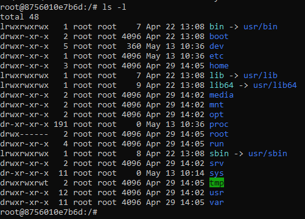

#### Utworzenie pliku tekstowego, wypisanie zawartości pliku
` echo "skni" > skni.txt`
`cat skni.txt`
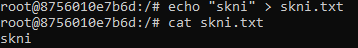

#### Wyjście z basha za pomocą CTRL D

#### Sprawdzenie jakie mamy kontenery
`docker container ls -a`
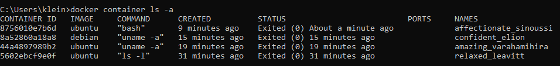
`docker container ls`- te kontenery które cały czas działaja
#### Uruchomienie wyłączonego kontenera
`docker start affectionate_sinoussi`
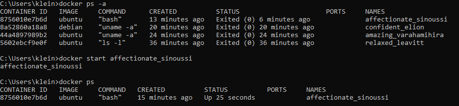

#### Wykonanie polecenia wewnątrz działającego kontenera- odczytanie pliku poprzednio zapisanego
`docker exec 8756 cat skni.txt`
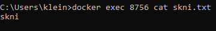

### Część 2- obrazy
#### Tworzenie obrazu
`docker commit 8756 skni_img`
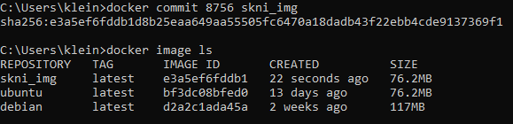

### Wyświetlenie warstw w obrazie
`docker history skni_img`
`docker history ubuntu `
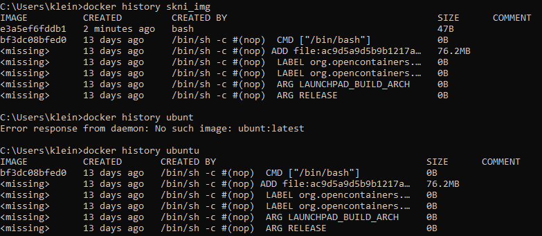

#### Na podstawie własnego obrazu stworzenie nowego kontenera
`docker run -it skni_img bash`
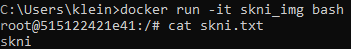

#### Zainstalowanie nowego programu w kontenerze
`apt update && apt install vim`
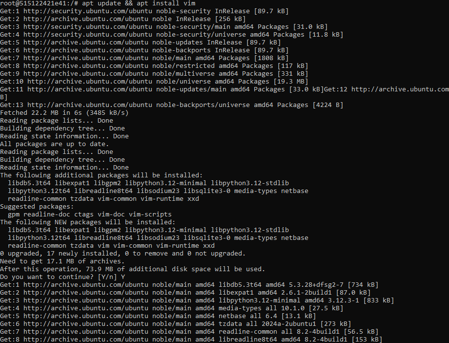

#### Stworzenie nowego obrazu w którym mamy vim
`docker commit 5151 vim_img`
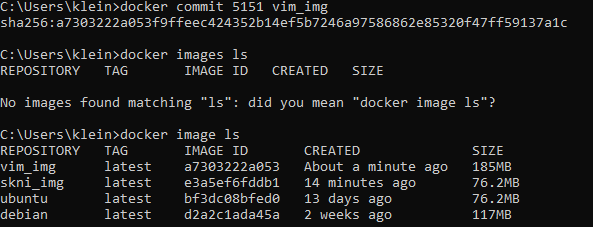
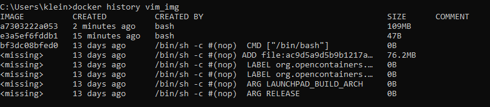

### Docker Hub
#### Ściąganie obrazu alpine z docker hub i postgres
`docker run alpine ls -l`
`docker pull postgres`
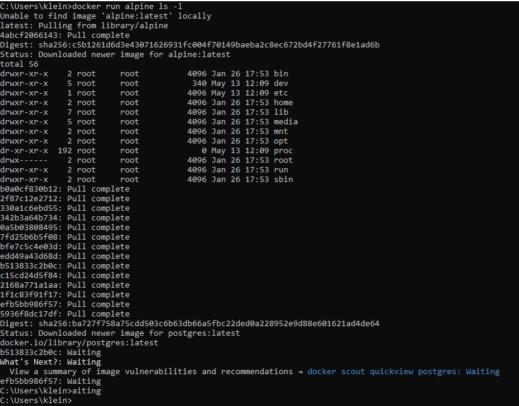

#### Wgrywanie obrazów na docker hub
`docker push skni_img`
oraz zmiana nazwy obrazu `docker tag skni_img juliakleinszmidt/obraz`
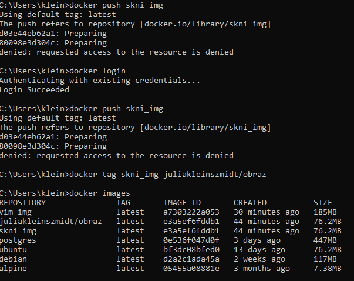

`docker push juliakleinszmidt/obraz`
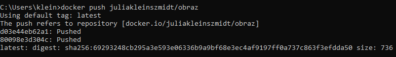
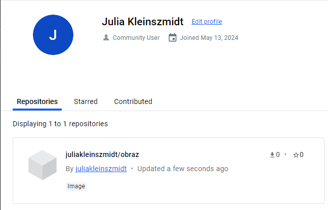

### Docker file
#### Kopiowanie plików z kontenera na komputer hosta
`docker cp elegant_ptolemy:/skni.txt .`
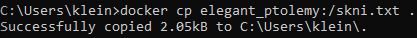

#### Uruchomienie Dockerfile
`notepad Dockerfile`
Do obrazu Ubuntu dodalismy nasz plik skni wszystko wpisane i otworzone w notatniku

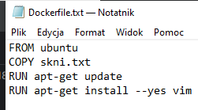

Następnie by sprawdzic zawartość 
`dir`
oraz `docker build .` by zbudować Dockerfile
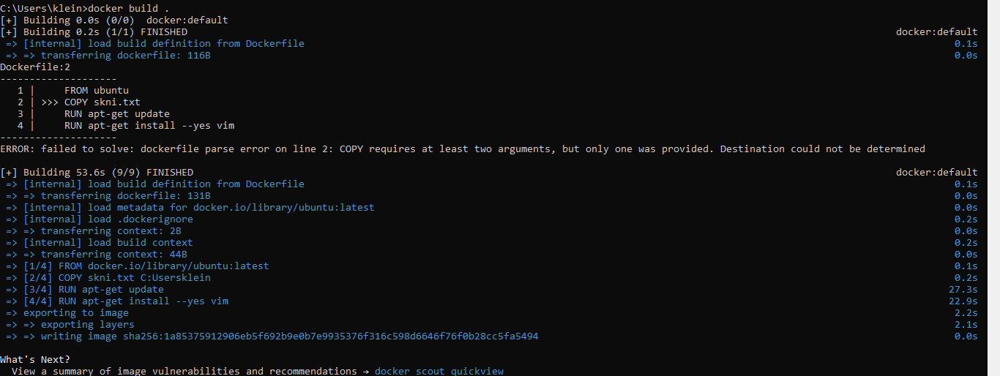

Zmiana nazwy
`docker build --tag mojvim .`
`docker tag mojvim:latest mojvim:2.0`
`docker images`


Zbudowanie nowego obrazau ubuntu 20.04
`docker build --tag mojvim:ubuntu20 .`
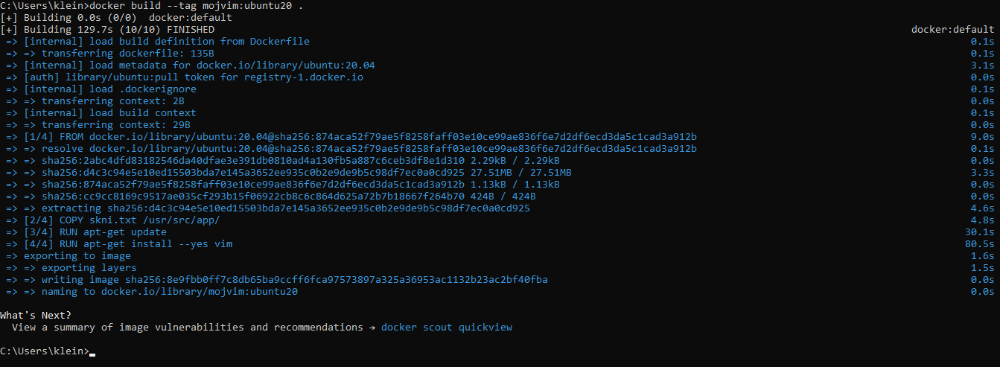

Utworzenie nowego katalogu ctx, a następnie umieszczenie w nim obrazu 
`echo "asd" > skni.txt`
`docker build -f ../Dockerfile .`
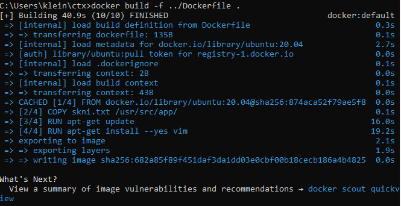
`docker run 682a85 cat /usr/src/app/skni.txt`
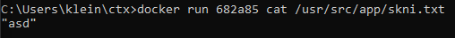


Otworzenie Dockerfile w nowym katalogu oraz skopiowanie do niego pliku

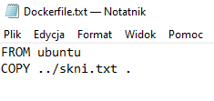

Następnie usunięcie skni.txt z poprzedniego katalogu
`del skni.txt`
i sprawdzenie zawartości z katalogu wyżej
`dir` a potem `dir ..`

Odpalić Dockerfile z niższego katalogu ale niestety już występuje błąd. 

### Konteneryzacja aplikacji konsolowej i webowej  
Znalezienie lokalizacji pythona
`cd "C:\Users\klein\AppData\Roaming\Microsoft\Windows\Start Menu\Programs\Python 3.12"`

Następnie uwtorzenie pliku python2
`mkdir python2`

Następnie tworzenie aplikacji
`notepad app.py`
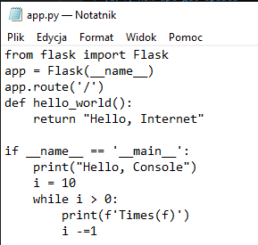

Następnie plik requirements
`notepad requirements.txt` - w nim jedynie uruchamiamy flask

Sprawdzamy nasz katalog jaką ma treść
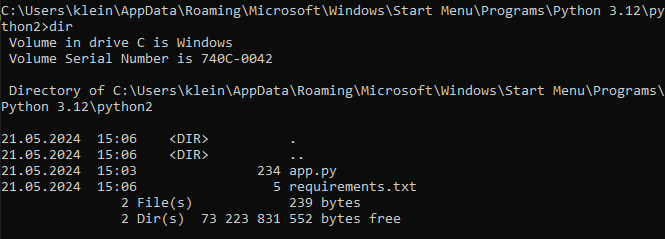

I tworzymy obraz 
`docker build --tag pyapp .`

Teraz odpalamy nasz projekt 
`docker run pyapp`
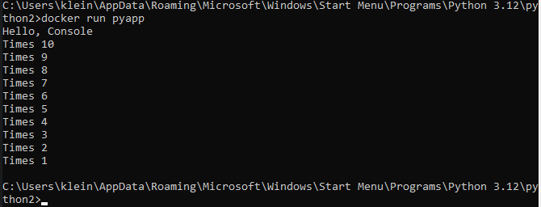

Teraz zmieniamy w Dockerfile kod 
```
FROM python:3.8

COPY requirements.txt .
RUN pip install -r requirements.txt

COPY app.py .

CMD FLASK_APP=app python -m flask run --host=0.0.0.0

```

`docker build -t pyapp:web .`
`docker run pyapp:web`
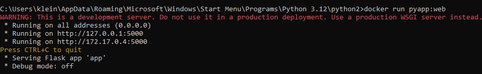
`docker run --publish 5000 pyapp:web`
`docker ps`
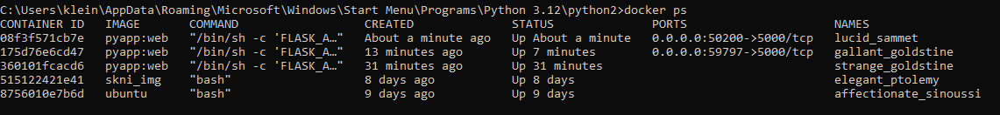

Wpisanie dwóch portów, podpinanie portów z kontenera na porty na moim komputerze
`docker run --publish 5123:5000 pyapp .`

