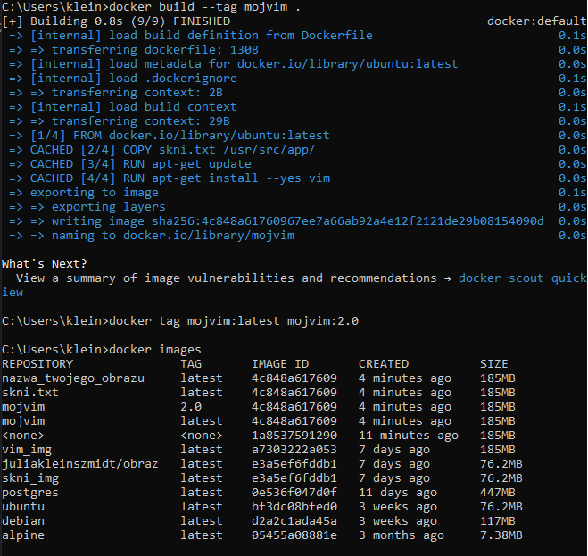
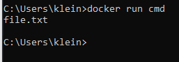
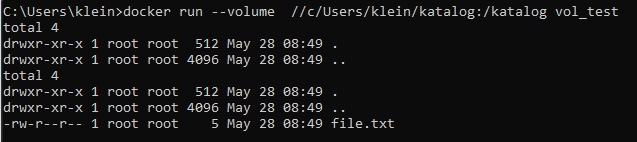
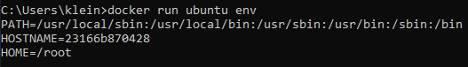

## KURS DOCKERA

### Część 1
#### Uruchomienie nowego kontenera na podstawie obrazu ubuntu
`docker run ubuntu ls -l`


#### Wyświetlenie wersji jądra systemu operacyjnego
`docker run ubuntu uname -a`


#### Zmiana obrazu na inną dystrybucję Linuxa 
`docker run debian uname -a`


#### Uruchomienie kontenera bash 
`docker run --interactive --tty ubuntu bash`


Możemy robić różne operacje wewnątrz pliku
`ls -l`


#### Utworzenie pliku tekstowego, wypisanie zawartości pliku
` echo "skni" > skni.txt`
`cat skni.txt`


#### Wyjście z basha za pomocą CTRL D

#### Sprawdzenie jakie mamy kontenery
`docker container ls -a`

`docker container ls`- te kontenery które cały czas działaja
#### Uruchomienie wyłączonego kontenera
`docker start affectionate_sinoussi`


#### Wykonanie polecenia wewnątrz działającego kontenera- odczytanie pliku poprzednio zapisanego
`docker exec 8756 cat skni.txt`


### Część 2- obrazy
#### Tworzenie obrazu
`docker commit 8756 skni_img`


### Wyświetlenie warstw w obrazie
`docker history skni_img`
`docker history ubuntu `


#### Na podstawie własnego obrazu stworzenie nowego kontenera
`docker run -it skni_img bash`


#### Zainstalowanie nowego programu w kontenerze
`apt update && apt install vim`


#### Stworzenie nowego obrazu w którym mamy vim
`docker commit 5151 vim_img`


### Docker Hub
#### Ściąganie obrazu alpine z docker hub i postgres
`docker run alpine ls -l`
`docker pull postgres`


#### Wgrywanie obrazów na docker hub
`docker push skni_img`
oraz zmiana nazwy obrazu `docker tag skni_img juliakleinszmidt/obraz`


`docker push juliakleinszmidt/obraz`


### Docker file
#### Kopiowanie plików z kontenera na komputer hosta
`docker cp elegant_ptolemy:/skni.txt .`


#### Uruchomienie Dockerfile
`notepad Dockerfile`
Do obrazu Ubuntu dodalismy nasz plik skni wszystko wpisane i otworzone w notatniku


Następnie by sprawdzic zawartość 
`dir`
oraz `docker build .` by zbudować Dockerfile


Zmiana nazwy
`docker build --tag mojvim .`
`docker tag mojvim:latest mojvim:2.0`
`docker images`


Zbudowanie nowego obrazau ubuntu 20.04
`docker build --tag mojvim:ubuntu20 .`


Utworzenie nowego katalogu ctx, a następnie umieszczenie w nim obrazu 
`echo "asd" > skni.txt`
`docker build -f ../Dockerfile .`

`docker run 682a85 cat /usr/src/app/skni.txt`


Otworzenie Dockerfile w nowym katalogu oraz skopiowanie do niego pliku


Następnie usunięcie skni.txt z poprzedniego katalogu
`del skni.txt`
i sprawdzenie zawartości z katalogu wyżej
`dir` a potem `dir ..`

Odpalić Dockerfile z niższego katalogu ale niestety już występuje błąd. 

### Konteneryzacja aplikacji konsolowej i webowej  
Znalezienie lokalizacji pythona
`cd "C:\Users\klein\AppData\Roaming\Microsoft\Windows\Start Menu\Programs\Python 3.12"`

Następnie uwtorzenie pliku python2
`mkdir python2`

Następnie tworzenie aplikacji
`notepad app.py`


Następnie plik requirements
`notepad requirements.txt` - w nim jedynie uruchamiamy flask

Sprawdzamy nasz katalog jaką ma treść


I tworzymy obraz 
`docker build --tag pyapp .`

Teraz odpalamy nasz projekt 
`docker run pyapp`


Teraz zmieniamy w Dockerfile kod 
```
FROM python:3.8

COPY requirements.txt .
RUN pip install -r requirements.txt

COPY app.py .

CMD FLASK_APP=app python -m flask run --host=0.0.0.0

```

`docker build -t pyapp:web .`
`docker run pyapp:web`

`docker run --publish 5000 pyapp:web`
`docker ps`


Wpisanie dwóch portów, podpinanie portów z kontenera na porty na moim komputerze
`docker run --publish 5123:5000 pyapp .`

### CMD I ENTRYPOINT
`notepad cmd.Dockerfile` a w nim: 
```
FROM ubuntu

RUN mkdir /test
RUN touch /test/file.txt

CMD ls /test 
```
`docker build -f cmd.Dockerfile -t cmd .`


Na koniec wyświetla się zawartość katalogu
`docker run cmd`



`docker run cmd uname -a`
I pokazuje wersje jądra systemu operacyjnego
`Linux a54faa72670a 5.15.146.1-microsoft-standard-WSL2 #1 SMP Thu Jan 11 04:09:03 UTC 2024 x86_64 x86_64 x86_64 GNU/Linux`

Teraz tworzymy plik `notepad entrypoint.Dockerfile`
```
FROM ubuntu

RUN mkdir /test
RUN touch /test/file.txt

ENTRYPOINT ["ls", "-al"]

```
`docker build -f entrypoint.Dockerfile -t entry .`
`docker run entry`


### VOLUME
`docker volume create moj-volume`


`notepad vol.Dockerfile` z zawartością: 

```
FROM ubuntu 

WORKDIR /katalog

CMD ls -al && echo "test" > file.txt && ls -al
```

`docker build -f vol.Dockerfile -t vol_test .`
`docker run vol_test`

Przechowywanie danych między różnymi kontenerami

`docker run --volume moj-volume:/katalog vol_test`


Następnie usunięcie kontenerów vol_test
`docker rm 6017 523d 1cdd`
ale docker volume nadal żyje 


#### Anonimowe wolumeny nie trzeba podawac nazw volumenow docker sam je tworzy
`docker run --volume /katalog vol_test`


#### Bind mount umożliwia łączenie kontenerów z plikami lokalnymi
`docker run --volume //c/Users/katalog:/katalog vol_test`

zawartość katalogu
`dir katalog`


Obserwacja zmian w katalogu
`docker run -it --volume //c/Users/katalog:/katalog vol_test watch ls /katalog`


### Baza danych w kontenerze
Wypisanie wszystkich zmiennych srodowiskowych

`docker run ubuntu env`


Dodanie zmiennej środowiskowej

`docker run -e MOJA_ZMIENNA=true ubuntu env`


Wykorzystanie obrazu postgresa do uruchomienia bazy danych w kontenerze

`docker run --name baza --detach -e POSTGRES_PASSWORD=haslo postgres`


Uruchomienie wiersza polecen postgresa do wykonywania polecen
`docker exec -it baza psql --username postgres`


Tworzenie bazy z wolumenami aby zapisywac zmiany
`docker run --name baza --detach -e POSTGRES_PASSWORD=haslo --volume dane_bazy:/var/lib/postgresql/data po
stgres`


Gdy na nowo utworzymy baze z tym samym volumenem będziemy miec jej zawartosc


Podpiecie z zewnatrz z baza

`docker run --name baza --detach -e POSTGRES_PASSWORD=haslo -e POSTGRES_USER=ja --volume dane_bazy:/var/lib/postgresql/data -p 5432:5432 postgres`


### Docker Inspect
Wyświetla informacje o kontenerze
`docker inspect eca8`


### Docker Networks- wirtualne sieci w kontenerach
służa do komunikacji pomiędzy kontenerem a internetem oraz pomiedzy kontenerami na tym samym hostcie. Docker automatycznie tworzy sieci dla kontenerów.

`docker network ls` wypisujemy sieci


Uruchamiamy pare kontenerów na podstawie obrazu busybox
`docker run -dit --name contA busybox`sieć bridge domyślna
`docker run -dit --name contB busybox`


Można korzystac z internetu wewnatrz kontenerów
`docker network inspect bridge`


Wiersz poleceń w kontenerze A
`docker attach contA`

`ip addr` możemy sprawdzic interfejsy sieciowe wewntarz naszego kontenera


`ping google.com` sprawdzenie łączności z internetem


`ping 172.17.0.3` skontaktowanie się z kontenerem B


Na koniec zastopowanie i usunięcie kontenerów

#### Można tworzyć własne sieci i podłączać te kontenenry do różnych sieci typu bridge w trakcie dzialania kontenerow, mozna dowolnie wybierac kontenery które mogą byc podłaczone do naszej sieci, mozna pingowac po nazwie kontenera

`docker network create --driver bridge moja-siec` - utworzenie własnej sieci
`docker network ls`


Tworzenie kontenerow podlaczonych do sieci domyslnej
`docker run -dit --name contA busybox`

`docker run -dit --name contB busybox`

Kontener podłączony do sieci moja-siec
`docker run -dit --name contC --network moja-siec busybox`


`docker network connect moja-siec contB` podlaczenie kontenerow do konkretnej sieci


W kontenerze C działania takie same jak w poprzedniej czesci i polaczenie z contB


Kontener B znajduje sie w dwoch sieciach
 jedynie nie moglam sie polaczyc do contC
